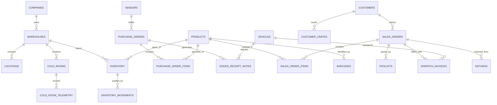

# Smart WMS (Warehouse Management System) - Database Architecture & Schema

This directory contains the production-ready relational database schema and seed dataset for the **Fruit & Vegetables Smart WMS (Cold Storage & Multi-Hub Warehouse Management System)**.

---

## 📁 Files in this Directory

- [`schema.sql`](./schema.sql): Complete DDL schema containing tables, relations, check constraints, foreign keys, timestamps, triggers, indexes, RLS policies, and FEFO allocation stored procedures.
- [`seed.sql`](./seed.sql): Relational initial seed data matching all default entities (users, locations, warehouses, products, vendors, customers, cold rooms, POs, inventory, picklists, dispatch invoices, returns, etc.).

---

## 🏗️ Entity-Relationship Architecture



---

## 📊 Core Modules & Tables

| Module | Table Name | Purpose | Primary Key | Key Foreign Keys |
| :--- | :--- | :--- | :--- | :--- |
| **Security & Auth** | `users` | User accounts, roles & module permissions | `id` | - |
| | `audit_logs` | Real-time audit trail of all warehouse actions | `id` | - |
| | `system_settings` | Barcode formats, OTP, FEFO/FIFO method | `key` | - |
| **Enterprise Master** | `companies` | Corporate enterprise profiles & GST | `id` | - |
| | `warehouses` | Facilities (Hybrid, Cold Storage, Dry Hub) | `id` | `company_id` |
| | `locations` | Bin locations (`A-01-01`), rack, shelf, temp zone | `id` | `warehouse_id` |
| | `categories` | Product classification (Fruits, Veg, Greens) | `id` | - |
| | `uoms` | Units of measure (`KG`, `BUNCH`, `CRATE`, `BOX`) | `id` | - |
| | `products` | Produce catalog, temp range, shelf life | `id` | - |
| | `barcodes` | Barcode & QR code SKU mappings | `id` | `product_id` |
| | `vendors` | Supplier master with GST & contact details | `id` | - |
| | `customers` | Client master with billing & shipping addresses | `id` | - |
| | `delivery_locations` | Outbound delivery destination options | `id` | - |
| | `kitchen_areas` | Customer kitchen / delivery area options | `id` | - |
| | `drivers` | Logistics drivers & driving license records | `id` | - |
| | `employees` | Warehouse workforce & departments | `id` | - |
| | `taxes` | GST slab configurations (5%, 12%, 18%) | `id` | - |
| | `reasons` | Quality rejection & damage reason codes | `id` | - |
| **Cold Chain** | `cold_rooms` | Cold rooms, temperature limits & alert status | `id` | `warehouse_id` |
| | `cold_room_telemetry` | Time-series temperature & humidity log | `id` | `cold_room_id` |
| **Gate & Yard** | `vehicles` | Gate-in/out passes, odometer & reefer temp logs | `id` | - |
| | `customer_crates` | Crate inventory reconciliation & sanitization | `id` | `customer_id` |
| **Inbound & PO** | `purchase_orders` | Vendor procurement orders & status lifecycle | `id` | `vendor_id` |
| | `purchase_order_items` | Line items with expected & received quantities | `id` | `purchase_order_id`, `product_id` |
| | `goods_receipt_notes` | Inward receiving dock GRN generation | `id` | `purchase_order_id`, `vendor_id` |
| **Inventory & Stock** | `inventory` | Live stock batches with expiry & FEFO tracking | `id` | `product_id`, `warehouse_id` |
| | `inventory_movements` | Stock transfers, putaway & split movement logs | `id` | `inventory_id`, `product_id` |
| **Outbound & Dispatch** | `sales_orders` | Outbound orders, delivery schedules & status | `id` | `customer_id` |
| | `sales_order_items` | Order line items with required & picked quantities | `id` | `sales_order_id`, `product_id` |
| | `picklists` | HHT / Batch picklists generated from SO | `id` | `customer_id` |
| | `dispatch_invoices` | Delivery challans, gatepasses & invoice ledger | `id` | - |
| **Reverse Logistics** | `returns` | Sales / QC returns & 4-way disposition workflow | `id` | `product_id` |

---

## ⚡ How to Apply to Supabase or PostgreSQL

### Option 1: Supabase Dashboard (Recommended)
1. Open your **Supabase Dashboard** -> Select your project.
2. Navigate to **SQL Editor** in the left sidebar.
3. Paste the contents of [`schema.sql`](./schema.sql) and click **RUN**.
4. Paste the contents of [`seed.sql`](./seed.sql) and click **RUN**.

### Option 2: Supabase CLI
```bash
# Link your local project to Supabase
supabase link --project-ref <your-project-id>

# Apply the schema and seed data
supabase db push
supabase db reset
```

### Option 3: Direct PostgreSQL / psql
```bash
psql -h <host> -U <username> -d <database_name> -f supabase/schema.sql
psql -h <host> -U <username> -d <database_name> -f supabase/seed.sql
```
